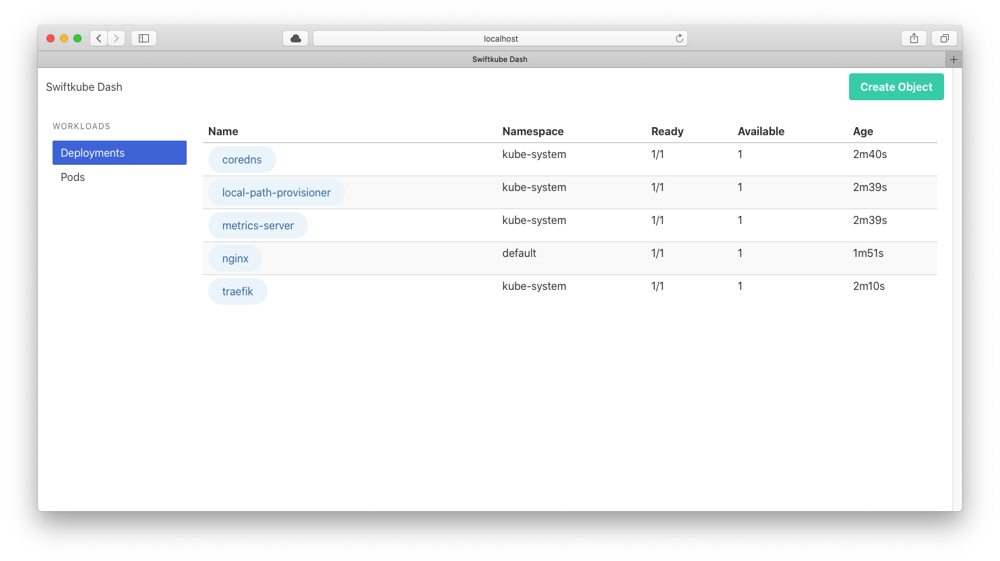
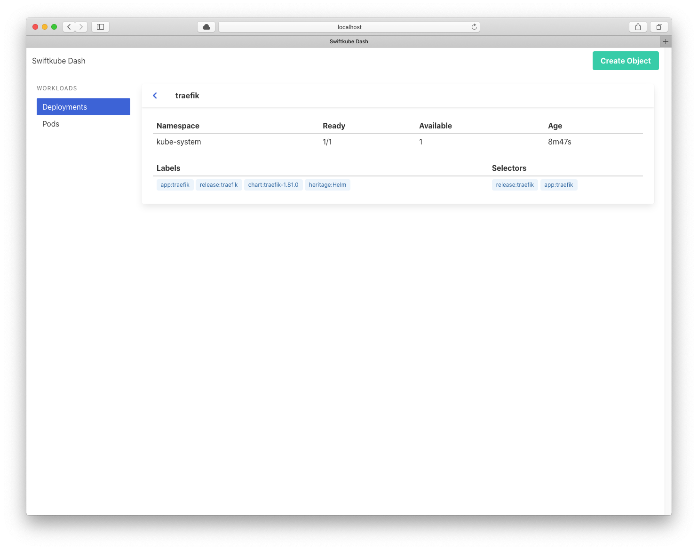
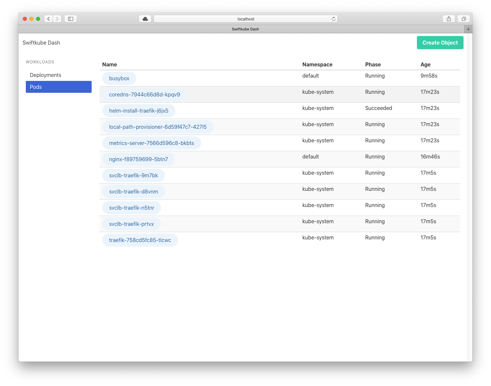
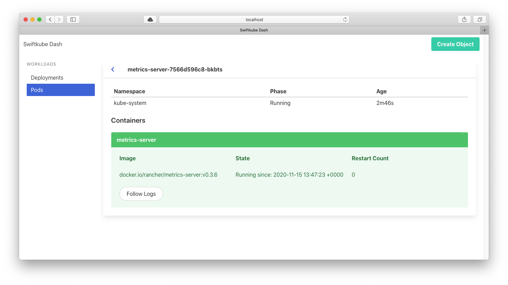
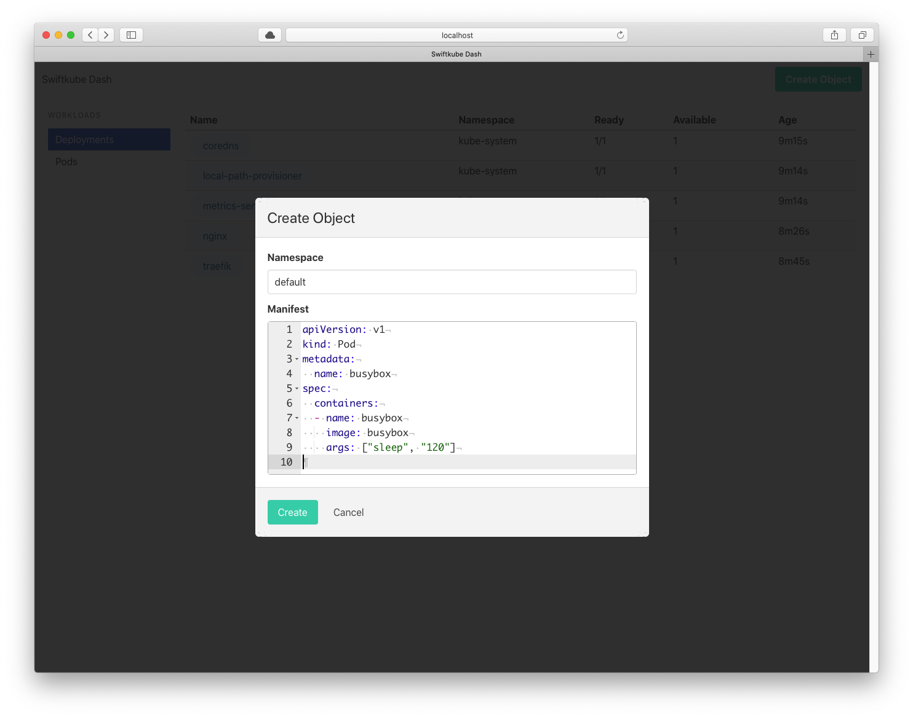

# SwiftkubeDash

<p align="center">
	
	
	
</p>

## Overview

A miny example dashboard using [SwiftkubeClient](https://github.com/swiftkube/client) on [Vapor](https://github.com/vapor/vapor).

## Screenshots








## Usage

:information_source: The app tries to determine the kubeconfig automatically so a valid config should be available at the correct location.

:information_source: The following permissions are required:

- List and Get deployments in all namespaces
- List and Get pods in all namespaces
- Create Resources in all namespaces


To try this just clone this repository and then depending on the environment:

```bash
$ git clone https://github.com/swiftkube/examples
$ cd examples/swiftkubedash
```

### Locally

If you want to run this locally, then just build the prject and start the executable:

```bash
$ swift build
$ .build/debug/Run serve --env production --hostname 0.0.0.0 --port 8080
```

A valid kubeconfig file should exists in your `$HOME/.kube/config`, which will be picked up and used by the app.

### Docker & Docker Compose

Build the docker image and run it. You can mount a valid kubeconfig into the running container via a volumen mount. For example you can mount your local config like this:

```bash
$ docker build . -t <image>
$ docker run -v $HOME/.kube/config:/app/.kube/config -p 8080:8080 <image> 
```

### Kubernetes

You can deploy the docker image in Kubernetes. The app will configure itself with the mounted service-account and namespace.

:warning: Review the manifests before applying random stuff into your cluster.

You can apply the manifests in the `deploy` folder:

:warning: If you deploy in any namespace other than `default`, then you have to change the subject's namesace in the [ClusterRoleBinding](./deploy/rbac.yaml)

```bash
kubectl apply -f ./deploy
```

This will create a deployment, configured with a service-account and a cluster-role, and a service of type `ClusterIP`. You can acces it like usual, e.g. a public ingress, port-forward .. etc.
